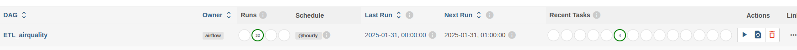

# Hiring Challenge DataEngineer

## 🚀 Description

Ce projet met en place un **pipeline ETL (Extract, Transform, Load) automatisé** avec Apache Airflow, permettant l’extraction, la transformation et le chargement des **données provenant de deux capteurs de surveillance de qualité de l'air** dans **MongoDB**.
Les données collectées sont ensuite accessibles via **Apache Drill**, offrant une interface **SQL** pour interroger **MongoDB**, et sont visualisées dans **Apache Superset** pour une analyse et un suivi en temps réel de la qualité de l'air.

## 🏗️ Technologies utilisées

- **Apache Airflow** : Orchestration du pipeline ETL
- **MongoDB** : Stockage des données
- **Apache Drill** : Accès SQL aux données MongoDB
- **Apache Superset** : Visualisation et exploration des données

## ⚡ Fonctionnalités

✔️ Extraction et transformation des données  
✔️ Chargement automatique dans MongoDB  
✔️ Connexion et interrogation SQL via Apache Drill  
✔️ Tableaux de bord interactifs avec Superset

## 🛠️ Installation & Exécution

**NB :** _Avant de poursuivre, il est important de noter que toutes les opérations ont été réalisées sur un système Linux. Si vous utilisez un autre système d'exploitation, vous devrez adapter les commandes en conséquence. Assurez-vous d'avoir déjà installé **MongoDB**, **Python** et **Java**._

---

1. **Cloner le Projet et Accéder au Répertoire** :
   ```sh
   git clone https://github.com/Lambda225/HiringChallengeDataEngineer.git
   cd HiringChallengeDataEngineer
   ```
2. **Créer et Activer un Environnement Virtuel**

   ```sh
    python3 -m venv .venv
    source .venv/bin/activate
   ```

3. **Installer les Dépendances Python**
   ```sh
   pip install -r requirements.txt
   ```
4. **Définir les Variables d'Environnement**

   Créez un fichier nommé .env à la racine du répertoire et ajoutez-y les variables suivantes en modifiant leurs valeurs :

   ```.env
   STATION_ID = keyStation1,keyStation1
   DB_URL = yourDataBaseUrl
   ```

5. **Lancer Apache Airflow et Exécuter le DAG**

   Définissez la variable d'environnement AIRFLOW_HOME :

   ```sh
   export AIRFLOW_HOME=projectPath
   ```

   Initialisez la base de données d'Airflow et créez un utilisateur administrateur :

   ```sh
   airflow db init
   airflow users create --username admin --firstname firstname --lastname lastname --role Admin --email admin@domain.com
   ```

   Après avoir entré le mot de passe, démarrez Airflow en mode autonome :

   ```sh
   airflow standalone
   ```

   Accédez ensuite à http://localhost:8080 pour vous connecter à Airflow et activer le DAG _ETL_airquality_.

   **NB** : _Assurez-vous que MongoDB est bien lancé avant de démarrer Airflow._

   

6. **Connecter MongoDB à Apache Drill**
   Lancez Apache Drill

   ```sh
   ./apache-drill-1.21.2/bin/drill-embedded
   ```

   Ensuite, accédez à http://localhost:8047, allez dans Storage, puis cliquez sur Enable en face de mongo.

   Dans l'onglet Query, exécutez la requête suivante pour vérifier que la connexion est bien établie :

   ```sql
   SELECT * FROM mongo.airquality.sensor
   ```

   **NB :** Vous pouvez modifier l'URL de connexion si celle par défaut ne correspond pas à votre configuration.

   

7. **Visualiser les Données avec Apache Superset**

   Définissez les variables d'environnement pour Superset :

   ```sh
   export FLASK_APP=superset
   export SUPERSET_CONFIG_PATH=yourProjectPath/superset_config.py
   ```

   Modifiez la variable `SQLALCHEMY_DATABASE_URI` dans `superset_config.py` pour lui indiquer le chemin correct, puis exécutez les commandes suivantes :

   ```sh
   superset db upgrade
   superset fab create-admin
   ```

   Après ces étapes, vous serez invité à créer votre utilisateur Superset.

   ```sh
   superset init
   ```

   Enfin, lancez Apache Superset :

   ```sh
   superset run -p 8088 --with-threads --reload --debugger
   ```

   Accédez à http://localhost:8088, puis allez dans l'onglet **Dashboards** et importez le fichier `dashboard_export_20250202T221928.zip`.

   **OPTIONNEL : Personnalisation du Dashboard**

   Pour personnaliser le dashboard, déplacez le dossier `data354` dans :

   ```sh
   .venv/lib/python3.10/site-packages/superset/static/assets/images
   ```

   Ensuite, décommentez les trois dernières lignes du fichier `superset_config.py`.

## ⏳ Comment Apache Airflow récupère les données chaque heure ?

Dans ce projet, nous avons eu à notre disposition une **API** fournissant des données issues de **deux stations de surveillance** qui mesurent, chaque heure, des informations sur la **qualité de l'air** sur une période d’un an.

L’ETL que nous avons conçu suit les étapes suivantes :

---

### 1️. **Extraction (Extract)**

- Récupération des données brutes provenant des **deux capteurs de qualité de l’air** via une API REST.
- Extraction des mesures de **température, PM2.5, CO, et autres polluants atmosphériques**.

---

### 2. **Vérification de l'existence de la base de données**

Avant de procéder à la transformation des données, nous nous connectons à **MongoDB** et vérifions si la base de données `airquality` existe déjà.

---

### 3️. **Transformation (Transform)**

🔹 **Pré-traitement des données** :

- Conversion de la variable **`timestamp`** en format date.
- Renommage de certaines variables pour assurer la cohérence des données.

🔹 **Deux cas de figure se présentent :**

1️. **Si la base de données `airquality` n'existe pas** :

- Calcul de la **moyenne journalière** des variables **CO et PM2.5**, sans prendre en compte la journée en cours si elle n'est pas terminée.

2️. **Si la base de données `airquality` existe** :

- Récupération de la **dernière valeur enregistrée** par chaque capteur.
- Mise à jour de la **moyenne journalière** des variables CO et PM2.5 si nous sommes en fin de journée.

---

### 4️. **Chargement (Load)**

- Stockage des données transformées dans **MongoDB**.
- Indexation pour une interrogation rapide via **Apache Drill**.
- Intégration des données dans **Apache Superset** pour la visualisation et l'analyse.

## 🚀 Mise en Production du Pipeline ETL avec Apache Airflow

Pour mettre en production ce projet, je vous recommande de créer une **machine virtuelle Linux** proposée par un **fournisseur cloud** (ex: AWS, Azure, GCP).

Vous devrez également disposer d'un **compte MongoDB**, soit via une **instance autogérée** (MongoDB installé sur votre VM) ou un **service managé** comme **MongoDB Atlas**.

Une fois la machine virtuelle créée, **accédez à la console** via **SSH** et suivez les étapes définies dans la section suivante :

🔗 [🛠️ Installation & Exécution](#-installation--exécution)

📌 **Prérequis recommandés** :

- Une machine virtuelle avec **Ubuntu 20.04+** ou **Debian**.
- Un accès **root** ou un utilisateur avec les permissions `sudo`.
- Une connexion Internet stable pour installer les dépendances.
- Un compte **MongoDB Atlas** ou une base **MongoDB locale**.

Une fois connecté à la machine virtuelle, vous pourrez procéder aux installations et configurations nécessaires pour exécuter le pipeline ETL avec **Apache Airflow**.

## 🎯 **Conclusion**

Ce projet a été une **expérience enrichissante**, permettant d’acquérir et de renforcer plusieurs compétences clés dans le domaine du **Big Data, de l'orchestration des workflows et de la visualisation des données**.

Grâce à la mise en place d’un **pipeline ETL automatisé** avec **Apache Airflow**, nous avons appris à orchestrer efficacement l’extraction, la transformation et le chargement des données issues de **capteurs de surveillance de la qualité de l'air**.

L’intégration avec **MongoDB** nous a permis de mieux comprendre le stockage et la gestion des bases de données **NoSQL**, tandis que **Apache Drill** nous a familiarisés avec l'interrogation des bases de données **semi-structurées** via SQL. Enfin, la visualisation des données avec **Apache Superset** a renforcé nos compétences en **analyse de données et en business intelligence**.
